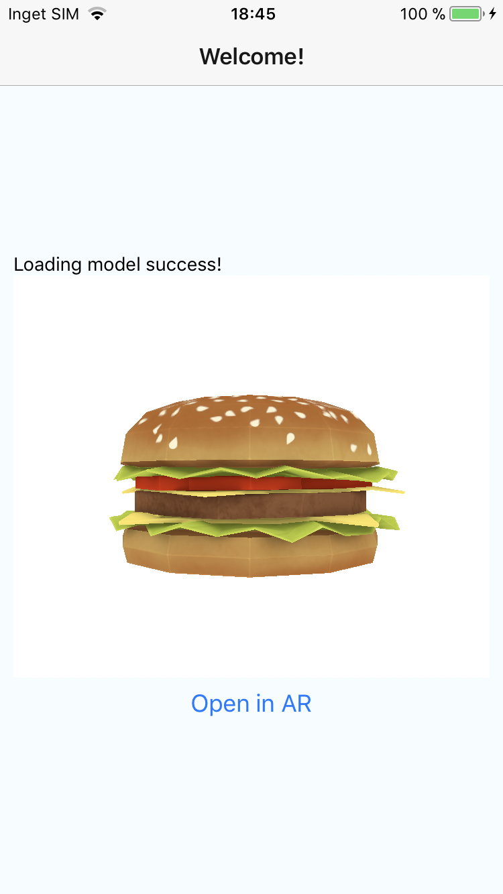
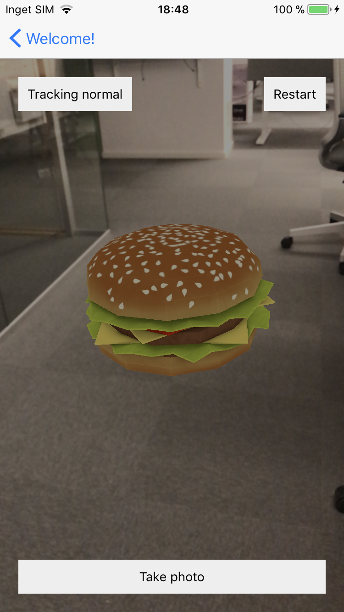

# react-native-3d-model-view

A React Native view for displaying .obj and .scn (iOS only) models either on screen or in AR (iOS device with A9 or later processors only).

**Example Project**: https://github.com/BonnierNews/react-native-3d-model-view/tree/master/example

**Note**: Currently only supports iOS (Android on the way).

## Getting started

`$ yarn add react-native-3d-model-view`

The lib also have peer dependencies of `react-native-zip-archive`, `react-native-fetch-blob` and `react-native-fs`. Make sure that you install and link them to.

### Mostly automatic installation

`$ react-native link react-3d-model-view`

## Usage

### Model view
```javascript

<ModelView
  source={{ uri: 'https://github.com/BonnierNews/react-native-3d-model-view/blob/master/example/obj/Hamburger.zip?raw=true' }}
  type={ModelTypes.OBJ}
  onLoadModelStart={this.onLoadModelStart}
  onLoadModelSuccess={this.onLoadModelSuccess}
  onLoadModelError={this.onLoadModelError} />

```


### AR Model view
```javascript

<ARModelView
  source={{ uri: 'https://github.com/BonnierNews/react-native-3d-model-view/blob/master/example/obj/Hamburger.zip?raw=true' }}
  type={ModelTypes.OBJ}
  scale={0.1}
  focusSquareColor='red'
  focusSquareFillColor='blue'
  onLoadModelStart={this.onLoadModelStart}
  onLoadModelSuccess={this.onLoadModelSuccess}
  onLoadModelError={this.onLoadModelError}
  onStart={this.onStart}
  onSurfaceFound={this.onSurfaceFound}
  onSurfaceLost={this.onSurfaceLost}
  onSessionInterupted={this.onSessionInterupted}
  onSessionInteruptedEnded={this.onSessionInteruptedEnded}
  onPlaceObjectSuccess={this.onPlaceObjectSuccess}
  onPlaceObjectError={this.onPlaceObjectError}
  onTrackingQualityInfo={this.onTrackingQualityInfo} />

```



## Contributing

If you find a bug or would like to request a new feature, just [open an issue](https://github.com/HippoAR/react-native-arkit/issues/new). Your contributions are always welcome! Submit a pull request and see [`CONTRIBUTING.md`](CONTRIBUTING.md) for guidelines.
## License

#### The MIT License (MIT)

Copyright (c) 2017 Johan Kasperi

Permission is hereby granted, free of charge, to any person obtaining a copy of this software and associated documentation files (the "Software"), to deal in the Software without restriction, including without limitation the rights to use, copy, modify, merge, publish, distribute, sublicense, and/or sell copies of the Software, and to permit persons to whom the Software is furnished to do so, subject to the following conditions:

The above copyright notice and this permission notice shall be included in all copies or substantial portions of the Software.

THE SOFTWARE IS PROVIDED "AS IS", WITHOUT WARRANTY OF ANY KIND, EXPRESS OR IMPLIED, INCLUDING BUT NOT LIMITED TO THE WARRANTIES OF MERCHANTABILITY, FITNESS FOR A PARTICULAR PURPOSE AND NONINFRINGEMENT. IN NO EVENT SHALL THE AUTHORS OR COPYRIGHT HOLDERS BE LIABLE FOR ANY CLAIM, DAMAGES OR OTHER LIABILITY, WHETHER IN AN ACTION OF CONTRACT, TORT OR OTHERWISE, ARISING FROM, OUT OF OR IN CONNECTION WITH THE SOFTWARE OR THE USE OR OTHER DEALINGS IN THE SOFTWARE.
